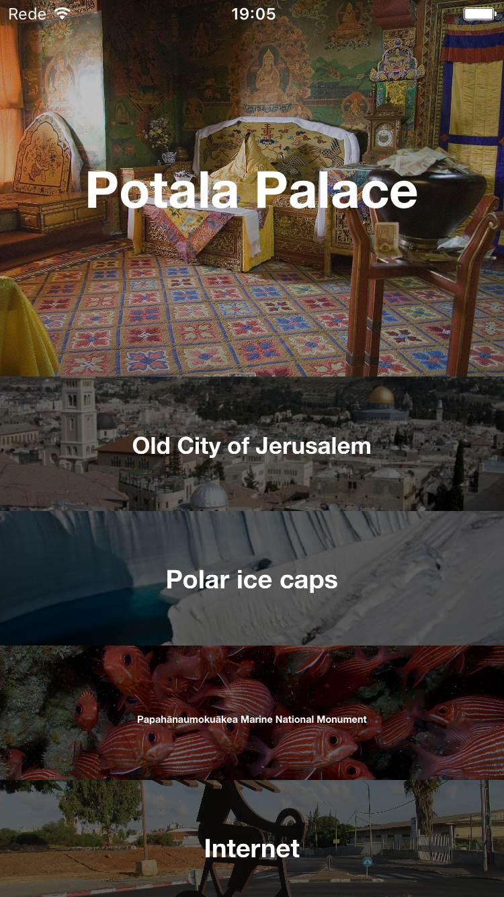

# ScrollShow

iOS Demo app with Expanding Collection View Cells
implemented following [Collection View Expanding Cells tutorial](https://www.raywenderlich.com/99087/swift-expanding-cells-ios-collection-views) from Ray Wenderlich, but in Objective-C, for better understanding of Custom UICollectionViewLayouts.

Used the USA Today's New Seven Wonders List as content.

## The original

## My implementation

## TODO
1. Add the rest of the details to the cards
2. Cards selection redirecting to wikipedia link maybe
3. Horizontal orientation with diferent animation
